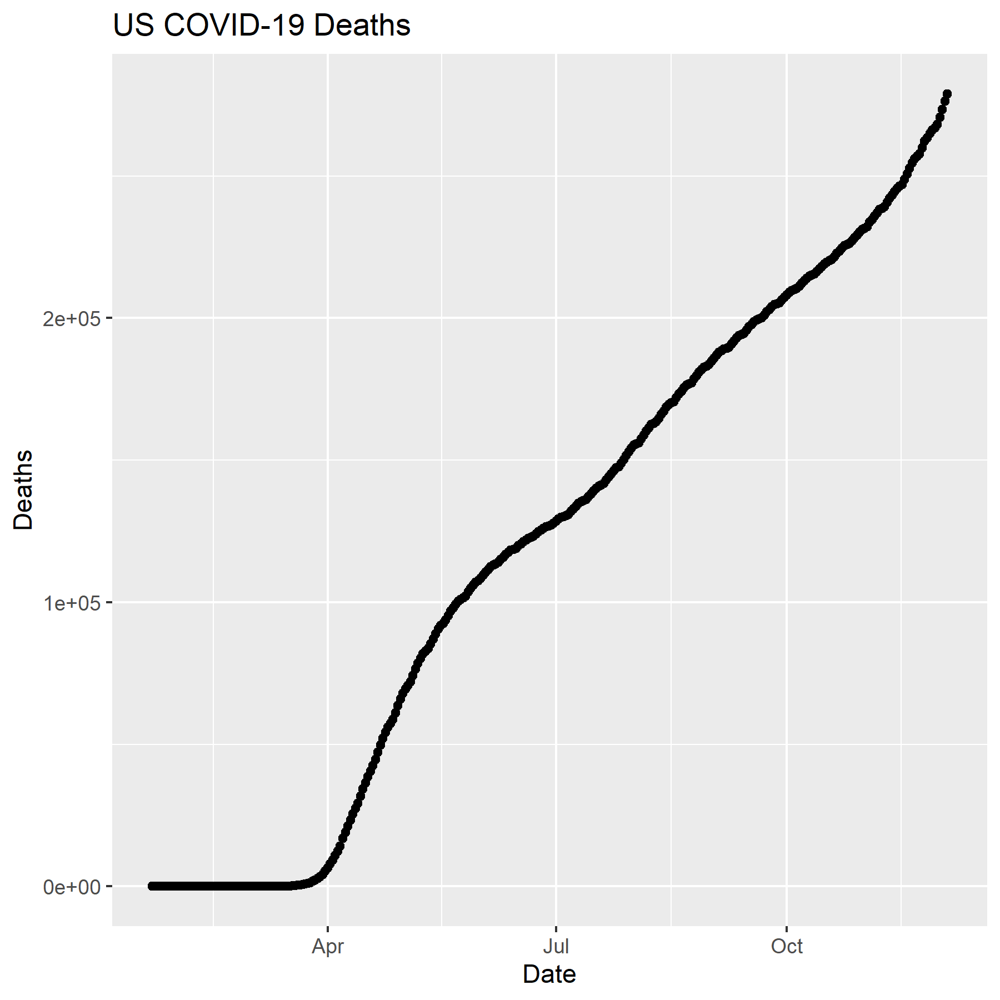

```{r setup, include=FALSE}
knitr::opts_chunk$set(echo = TRUE)
```

### Data for Lab
```{r}
library(tidyverse)
library(lubridate)

time_series_confirmed_long <- read_csv(url("https://raw.githubusercontent.com/CSSEGISandData/COVID-19/master/csse_covid_19_data/csse_covid_19_time_series/time_series_covid19_confirmed_global.csv")) %>%
  rename(Province_State = "Province/State", Country_Region = "Country/Region")  %>% 
               pivot_longer(-c(Province_State, Country_Region, Lat, Long),
                             names_to = "Date", values_to = "Confirmed") 
# Let's get the times series data for deaths
time_series_deaths_long <- read_csv(url("https://raw.githubusercontent.com/CSSEGISandData/COVID-19/master/csse_covid_19_data/csse_covid_19_time_series/time_series_covid19_deaths_global.csv")) %>%
  rename(Province_State = "Province/State", Country_Region = "Country/Region")  %>% 
  pivot_longer(-c(Province_State, Country_Region, Lat, Long),
               names_to = "Date", values_to = "Deaths")
# Create Keys 
time_series_confirmed_long <- time_series_confirmed_long %>% 
  unite(Key, Province_State, Country_Region, Date, sep = ".", remove = FALSE)
time_series_deaths_long <- time_series_deaths_long %>% 
  unite(Key, Province_State, Country_Region, Date, sep = ".") %>% 
  select(Key, Deaths)
# Join tables
time_series_long_joined <- full_join(time_series_confirmed_long,
    time_series_deaths_long, by = c("Key")) %>% 
    select(-Key)
# Reformat the data
time_series_long_joined$Date <- mdy(time_series_long_joined$Date)
# Create Report table with counts
time_series_long_joined_counts <- time_series_long_joined %>% 
  pivot_longer(-c(Province_State, Country_Region, Lat, Long, Date),
               names_to = "Report_Type", values_to = "Counts")

###Graphic Output
pdf("Images/time_series_example_plot.pdf", width=6, height=3)
time_series_long_joined %>% 
  group_by(Country_Region,Date) %>% 
  summarise_at(c("Confirmed", "Deaths"), sum) %>% 
  filter (Country_Region == "US") %>% 
    ggplot(aes(x = Date,  y = Deaths)) + 
    geom_point() +
    geom_line() +
    ggtitle("US COVID-19 Deaths")
dev.off()

# Plot graph to a png outputfile
ppi <- 300
png("Images/time_series_example_plot.png", width=6*ppi, height=6*ppi, res=ppi)
time_series_long_joined %>% 
  group_by(Country_Region,Date) %>% 
  summarise_at(c("Confirmed", "Deaths"), sum) %>% 
  filter (Country_Region == "US") %>% 
    ggplot(aes(x = Date,  y = Deaths)) + 
    geom_point() +
    geom_line() +
    ggtitle("US COVID-19 Deaths")
dev.off()

```

### Interactive Graphs
```{r}
# Version 2
library(plotly)
ggplotly(
  time_series_long_joined %>% 
    group_by(Country_Region,Date) %>% 
    summarise_at(c("Confirmed", "Deaths"), sum) %>% 
    filter (Country_Region == "US") %>% 
    ggplot(aes(x = Date,  y = Deaths)) + 
      geom_point() +
      geom_line() +
      ggtitle("US COVID-19 Deaths")
 )

library(plotly)
# Subset the time series data to include US deaths
US_deaths <- time_series_long_joined %>% 
    group_by(Country_Region,Date) %>% 
    summarise_at(c("Confirmed", "Deaths"), sum) %>% 
    filter (Country_Region == "US")
# Collect the layers for agraph of the US time series data for covid deaths
 p <- ggplot(data = US_deaths, aes(x = Date,  y = Deaths)) + 
        geom_point() +
        geom_line() +
        ggtitle("US COVID-19 Deaths")
# Plot the graph using ggplotly
ggplotly(p)
```
###Creating animation
```{r}
library(gganimate)
library(transformr)
theme_set(theme_bw())

data_time <- time_series_long_joined %>% 
    group_by(Country_Region,Date) %>% 
    summarise_at(c("Confirmed", "Deaths"), sum) %>% 
    filter (Country_Region %in% c("China","Korea, South","Japan","Italy","US")) 
p <- ggplot(data_time, aes(x = Date,  y = Confirmed, color = Country_Region)) + 
      geom_point() +
      geom_line() +
      ggtitle("Confirmed COVID-19 Cases") +
      geom_point(aes(group = seq_along(Date))) +
      transition_reveal(Date) 
# Some people needed to use this line instead
# animate(p,renderer = gifski_renderer(), end_pause = 15)
animate(p, end_pause = 15)

data_time <- time_series_long_joined %>% 
    group_by(Country_Region,Date) %>% 
    summarise_at(c("Confirmed", "Deaths"), sum) %>% 
    filter (Country_Region %in% c("China","Korea, South","Japan","Italy","US")) 
p <- ggplot(data_time, aes(x = Date,  y = Confirmed, color = Country_Region)) + 
      geom_point() +
      geom_line() +
      ggtitle("Confirmed COVID-19 Cases") +
      geom_point(aes(group = seq_along(Date))) +
      transition_reveal(Date) 
# Some people needed to use this line instead
# animate(p,renderer = gifski_renderer(), end_pause = 15)
anim_save("deaths_5_countries.gif", p)
```
###Exercises1
```{r}
ppi <- 300
png("Images/time_series_Mine_plot.png", width=3*ppi, height=3*ppi, res=ppi)
time_series_long_joined %>% 
  group_by(Country_Region,Date) %>% 
  summarise_at(c("Confirmed", "Deaths"), sum) %>% 
  filter (Country_Region == "US") %>% 
    ggplot(aes(x = Date,  y = Deaths)) + 
    geom_point() +
    geom_line() +
    ggtitle("US COVID-19 Deaths Dark")+
  theme_dark()
dev.off()
```


###Exercise 2
```{r, fig.width = 6, fig.height = 6}
ggplotly(
  time_series_long_joined_counts %>% 
  group_by(Country_Region, Report_Type, Date) %>% 
  summarise(Counts = sum(Counts)) %>% 
  filter (Country_Region == "US") %>% 
  filter (Report_Type == "Confirmed") %>% 
    ggplot(aes(x = Date,  y = log2(Counts), fill = Report_Type, color = Report_Type)) + 
    geom_point() +
    geom_line() +
    ggtitle("Confirmed US COVID-19 Cases") +
    facet_wrap(~Country_Region, nrow=5, scales="free") +
  theme_dark()
)
```
###Exercise 3
```{r, fig.width = 6, fig.height = 6}
time_series_confirmed <- read_csv(url("https://raw.githubusercontent.com/CSSEGISandData/COVID-19/master/csse_covid_19_data/csse_covid_19_time_series/time_series_covid19_confirmed_global.csv")) %>%
  rename(Province_State = "Province/State", Country_Region = "Country/Region")

time_series_confirmed <- read_csv("data/time_series_covid19_confirmed_global.csv")%>%
  rename(Province_State = "Province/State", Country_Region = "Country/Region")
 
time_series_confirmed_long <- time_series_confirmed %>% 
               pivot_longer(-c(Province_State, Country_Region, Lat, Long),
                            names_to = "Date", values_to = "Confirmed") 

 time_series_deaths <- read_csv("data/time_series_covid19_deaths_global.csv")%>%
  rename(Province_State = "Province/State", Country_Region = "Country/Region")
 
 time_series_deaths_long <- time_series_deaths %>% 
               pivot_longer(-c(Province_State, Country_Region, Lat, Long),
                            names_to = "Date", values_to = "Deaths") 
head(time_series_deaths_long)

time_series_confirmed_long <- time_series_confirmed_long %>% 
  unite(Key, Province_State, Country_Region, Date, sep = ".", remove = FALSE)
head(time_series_confirmed_long)

time_series_deaths_long <- time_series_deaths_long %>% 
  unite(Key, Province_State, Country_Region, Date, sep = ".") %>% 
  select(Key, Deaths)

time_series_long_joined <- full_join(time_series_confirmed_long,
              time_series_deaths_long, by = c("Key")) %>% 
              select(-Key)
head(time_series_long_joined)

time_series_long_joined$Date <- mdy(time_series_long_joined$Date)

time_series_long_joined_counts <- time_series_long_joined %>% 
  pivot_longer(-c(Province_State, Country_Region, Lat, Long, Date),
               names_to = "Report_Type", values_to = "Counts")
head(time_series_long_joined_counts)

data_time <- time_series_long_joined %>% 
    group_by(Country_Region,Date) %>% 
    summarise_at(c("Confirmed", "Deaths"), sum) %>% 
    filter (Country_Region %in% c("US","Brazil","India","Mexico","UK","Italy","France", "Iran", "Spain", "Russia")) 
p <- ggplot(data_time, aes(x = Date,  y = Confirmed, color = Country_Region)) + 
      geom_point() +
      geom_line() +
      ggtitle("Top 10 Confirmed COVID-19 Cases") +
      geom_point(aes(group = seq_along(Date))) +
      transition_reveal(Date) 
# Some people needed to use this line instead
# animate(p,renderer = gifski_renderer(), end_pause = 15)
animate(p, end_pause = 15)
```

